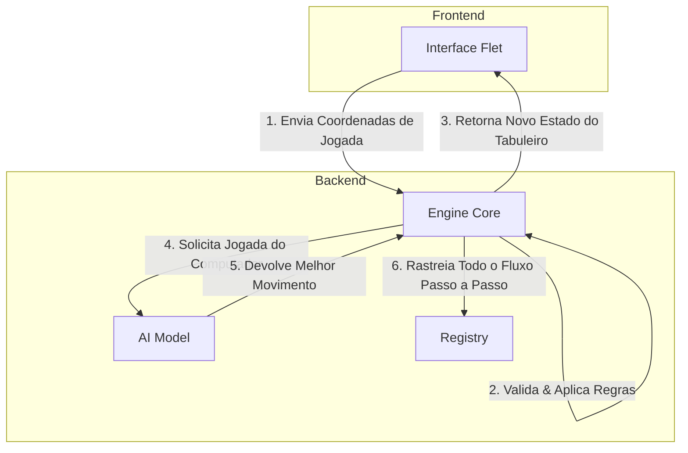

# Arquitetura Macro do Sistema

Bem-vindo à biblioteca SSOT (Single Source of Truth) do Super Jogo da Velha. 
Este documento descreve a arquitetura geral da reescrita do sistema.

## Os 4 Pilares (Módulos)

O sistema foi redesenhado para ter baixo acoplamento e alta coesão, dividido em 4 módulos principais:

### 1. Engine
O coração matemático e lógico do jogo. 
- Gerencia a matriz 9x9 (os 9 mini-tabuleiros).
- Aplica as regras: se a jogada foi válida, qual o próximo mini-tabuleiro habilitado, se houve empate ou vitória.
- **Acesso:** Não possui interface visual. É puramente lógico e será acessado via chamadas de API ou como uma biblioteca encapsulada.

### 2. Interface
A camada de apresentação e interação humana.
- Consome o estado fornecido pela Engine e renderiza os dados utilizando **Flet**.
- Apresenta feedback visual moderno, suportando deploys unificados via Flet para Mobile, Desktop e Web.
- Totalmente agnóstica em relação às regras de negócio (Burra). Confia na Engine para saber o que é válido.

### 3. AI (Artificia Intelligence)
Oponente controlado por máquina.
- Observa o estado público exportado pela Engine.
- **Versão V1:** Baseada em regras heurísticas para decisões imediatas e táticas.
- **Preparação:** Desenvolvida numa linguagem de tooling voltado a dados (Python), com abstrações claras que permitam substituição fácil da heurística por um modelo treinado (ML) no futuro.

### 4. Registry
O sistema nervoso de rastreamento do aplicativo.
- Captura todos os logs operacionais (sistema subindo, rotas acessadas).
- Emite e guarda o histórico de *jogadas* (Match History) - quem jogou onde, qual o estado final, tempo de pensamento da IA.
- Mantém o **Traceback facilitado**: Em caso de falha sistêmica, o Registry deve cuspir o exato estado da Engine no milissegundo do crash.
- Se tornará o repositório formador de *datasets* para o Módulo de IA.

---
*Registro adicionado ao Cânone durante o Momento Canônico V1 - Fase de Planejamento. Este documento guia todas as implementações subsequentes e não sofrerá mutação sem transição explícita.*
