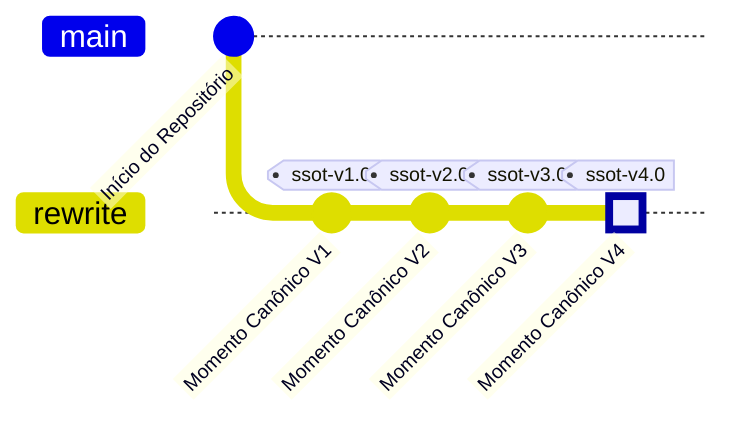

# O Cânone

Para garantir uma Single Source of Truth (SSOT) estável e confiável, a documentação e os requisitos que moram nesta pasta formam o **Cânone**.

## O que é o Cânone?
O Cânone é o acervo de todos os documentos fundamentais da arquitetura, regras de negócio (casos de uso) e planos de implementação. 
**Regra de Ouro:** Os documentos do Cânone não devem ser modificados levianamente. Eles são mantidos sem alteração a não ser que haja uma solicitação formal e explícita para mudá-los (uma transição na arquitetura do sistema). 

## O que são os 'Momentos Canônicos'?
Os Momentos Canônicos são os **commits** (e *tags* de repositório) feitos com o propósito exclusivo de adicionar ou consolidar mudanças no Cânone. Eles representam a linha do tempo da evolução oficial do nosso projeto.

## Registro Histórico de Momentos Canônicos

- **[V1 - Planejamento Inicial]:** O primeiro grande marco. Estabeleceu a divisão dos 4 módulos lógicos orquestrados via TDD e definiu toda a stack em 100% Python, utilizando o framework *Flet* para unificar client Mobile, Desktop e Web.
- **[V2 - Abstração e Regras da Engine]:** Consolidação oficial das Histórias de Usuário, Casos de Uso detalhados por atores (Mermaid) e do Livro de Regras de Negócio (State Machine e Fluxo de Validação). Isso dá o aval absoluto e embasamento necessário para o início do desenvolvimento de código do backend.
- **[V3 - Testes TDD da Engine]:** Produção e consolidação das suítes de teste unitário da Engine (pytest), cobrindo 21 testes em 4 arquivos: inicialização (UC1), validação de jogadas (UC2/UC3), estado do mini-tabuleiro e passe livre (UC4/UC5), e término de jogo global com vitória por pontos (UC6/UC7). Os testes seguem a filosofia RED — falham intencionalmente até que a implementação real os satisfaça. Registra também `uv` como ferramenta oficial de gerenciamento Python.
- **[V4 - Especificação Completa de Módulos] (Atual):** Expansão abrangente do Cânone cobrindo os 4 módulos do sistema. As Regras de Negócio receberam 3 novas seções: §5 (IA Heurística V1 — contrato de entrada/saída, hierarquia de prioridades, regras de tempo), §6 (Registry — schema do `MatchPayload`, tipos de evento, persistência write-ahead) e §7 (Interface — agnosticismo, renderização de estado, feedback visual, modos de partida, fluxo de navegação com prompt de saída mid-game, responsividade e tema automático via OS). Foi adicionado o documento `design_de_interface.md` ao Cânone, contendo: layout do tabuleiro com wireframes ASCII, sistema de cores com política de tema dinâmico, estados visuais de mini-tabuleiros e células, hierarquia de componentes Flet, wireframes de todas as 6 telas (Menu, Configuração, Jogo, Resultado, Onboarding, Prompt de Saída) e tabela de animações com durações. Este momento marca a conclusão da fase de planejamento para todos os 4 módulos.
