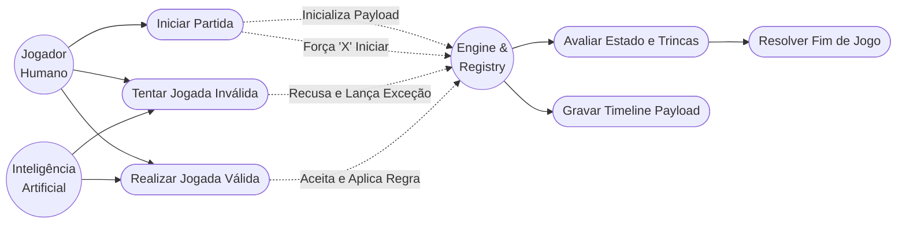

# Casos de Uso (Use Cases)

> **⚠️ STATUS: RASCUNHO (Não-Canônico)** 
> *Este documento reflete as regras de negócio destrinchadas. Será tornado canônico junto das histórias de usuário.*

Este documento dita o comportamento esperado para cada interação possível no sistema, servindo de base para testes e desenvolvimento.

## 1. Diagrama de Casos de Uso (Por Atores)

O sistema possui três Atores principais: O **Jogador Humano** (através da Interface Flet), a **Inteligência Artificial** e a **Engine/Registry** (O pr óprio sistema).

## 2. Casos de Uso Principais (Mecânica e Regras)

**UC1: Inicialização da Partida**
- **Ator:** Jogador Humano.
- **Fluxo:** O Humano solicita via Interface uma nova partida (contra IA ou Local). A Engine cria as 9 matrizes 3x3 limpas.
- **Resultado Estrito:** O turno é obrigatoriamente atribuído ao jogador 'X'. O Registry abre o objeto unificado `MatchPayload`.

**UC2: Tentativa de Jogada Inválida**
- **Ator:** Humano ou IA.
- **Fluxo:** O Ator tenta jogar em uma célula que já possui um símbolo, ou num mini-tabuleiro diferente do obrigatório pela jogada anterior, ou quando não é sua vez.
- **Resultado Estrito:** A Engine lança uma Exceção (`InvalidMoveException`). O Registry _appenda_ o erro no Payload e a Interface apenas ignora o clique, mantendo a vez do mesmo Ator sem penalidades.

**UC3: Jogada Válida Convencional**
- **Ator:** Humano ou IA.
- **Fluxo:** O Ator envia as coordenadas corretamente.
- **Resultado Estrito:** O símbolo do Ator é grafado na célula. O status do mini-tabuleiro é analisado. A Engine dita qual será o próximo mini-tabuleiro válido para o oponente baseado na coordenada local dessa jogada. O Registry _appenda_ a alteração no Payload.

**UC4: Condição de Vitória ou Velha no Mini-Tabuleiro**
- **Ator:** Sistema (Engine).
- **Fluxo Pós-Jogada:** Caso as marcações formem 3 símbolos alinhados, a Engine encerra o mini-tabuleiro como `VENCIDO`. Se não houver alinhamento e as 9 casas encherem, a Engine o encerra como `EMPATADO` (Velha).
- **Resultado Estrito:** Nenhuma jogada adicional pode atuar naquele quadrante. Oponente que for enviado para ele ganhará 'Passe Livre'.

**UC5: Aplicação da Regra de Passe Livre**
- **Ator:** Sistema / Jogador do turno.
- **Fluxo:** Se o oponente na rodada anterior fez um movimento que obrigaria o Ator atual a jogar num mini-tabuleiro que já se encontra `VENCIDO` ou `EMPATADO`.
- **Resultado Estrito:** A restrição global de destino é anulada (Null). O Ator pode escolher clicar em qualquer espaço vazio de qualquer mini-tabuleiro que ainda esteja `ATIVO`.

**UC6: Encerramento Antecipado (Alinhamento Global)**
- **Ator:** Sistema.
- **Fluxo:** O Ator atual acaba de conquistar um mini-tabuleiro que formou uma linha/coluna/diagonal de mini-tabuleiros vencedores perante o macro-tabuleiro.
- **Resultado Estrito:** Status do game é alterado de `EM_ANDAMENTO` para `VITORIA_X/O`. Nenhum Input é mais aceito. Registry fecha o arquivo Payload.

**UC7: Encerramento por Esgotamento (Vitória por Pontos / Empate Absoluto)**
- **Ator:** Sistema.
- **Fluxo:** O Ator encerra um mini-tabuleiro com Empate ou Vitória, porém não há trinca principal, E simultaneamente não existe mais nenhum mini-tabuleiro `ATIVO` restante no jogo inteiro.
- **Resultado Estrito:** A Engine compara countages `VENCIDO_X` vs `VENCIDO_O`. Declara vitória do número maior. Caso sejam estritamente idênticos (apenas possível devido aos empates de placa), decreta `EMPATE_ABSOLUTO`. Registry fecha arquivo Payload.
