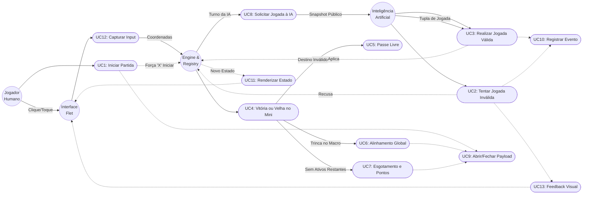

# Casos de Uso (Use Cases)

Este documento dita o comportamento esperado para cada interação possível no sistema, servindo de base para testes e desenvolvimento.

## 1. Diagrama de Casos de Uso (Por Atores)

O sistema possui três Atores principais: O **Jogador Humano** (através da Interface Flet), a **Inteligência Artificial** e a **Engine/Registry** (O próprio sistema).

## 2. Casos de Uso Principais (Mecânica e Regras)

**UC1: Inicialização da Partida**
- **Ator:** Jogador Humano.
- **Fluxo:** O Humano solicita via Interface uma nova partida (contra IA ou Local). A Engine cria as 9 matrizes 3x3 limpas.
- **Resultado Estrito:** O turno é obrigatoriamente atribuído ao jogador 'X'. O Registry abre o objeto unificado `MatchPayload`.

**UC2: Tentativa de Jogada Inválida**
- **Ator:** Humano ou IA.
- **Fluxo:** O Ator tenta jogar em uma célula que já possui um símbolo, ou num mini-tabuleiro diferente do obrigatório pela jogada anterior, ou quando não é sua vez.
- **Resultado Estrito:** A Engine lança uma Exceção (`InvalidMoveException`). O Registry _appenda_ o erro no Payload e a Interface apenas ignora o clique, mantendo a vez do mesmo Ator sem penalidades.

**UC3: Jogada Válida Convencional**
- **Ator:** Humano ou IA.
- **Fluxo:** O Ator envia as coordenadas corretamente.
- **Resultado Estrito:** O símbolo do Ator é grafado na célula. O status do mini-tabuleiro é analisado. A Engine dita qual será o próximo mini-tabuleiro válido para o oponente baseado na coordenada local dessa jogada. O Registry _appenda_ a alteração no Payload.

**UC4: Condição de Vitória ou Velha no Mini-Tabuleiro**
- **Ator:** Sistema (Engine).
- **Fluxo Pós-Jogada:** Caso as marcações formem 3 símbolos alinhados, a Engine encerra o mini-tabuleiro como `VENCIDO`. Se não houver alinhamento e as 9 casas encherem, a Engine o encerra como `EMPATADO` (Velha).
- **Resultado Estrito:** Nenhuma jogada adicional pode atuar naquele quadrante. Oponente que for enviado para ele ganhará 'Passe Livre'.

**UC5: Aplicação da Regra de Passe Livre**
- **Ator:** Sistema / Jogador do turno.
- **Fluxo:** Se o oponente na rodada anterior fez um movimento que obrigaria o Ator atual a jogar num mini-tabuleiro que já se encontra `VENCIDO` ou `EMPATADO`.
- **Resultado Estrito:** A restrição global de destino é anulada (Null). O Ator pode escolher clicar em qualquer espaço vazio de qualquer mini-tabuleiro que ainda esteja `ATIVO`.

**UC6: Encerramento Antecipado (Alinhamento Global)**
- **Ator:** Sistema.
- **Fluxo:** O Ator atual acaba de conquistar um mini-tabuleiro que formou uma linha/coluna/diagonal de mini-tabuleiros vencedores perante o macro-tabuleiro.
- **Resultado Estrito:** Status do game é alterado de `EM_ANDAMENTO` para `VITORIA_X/O`. Nenhum Input é mais aceito. Registry fecha o arquivo Payload.

**UC7: Encerramento por Esgotamento (Vitória por Pontos / Empate Absoluto)**
- **Ator:** Sistema.
- **Fluxo:** O Ator encerra um mini-tabuleiro com Empate ou Vitória, porém não há trinca principal, E simultaneamente não existe mais nenhum mini-tabuleiro `ATIVO` restante no jogo inteiro.
- **Resultado Estrito:** A Engine compara contagens `VENCIDO_X` vs `VENCIDO_O`. Declara vitória do número maior. Caso sejam estritamente idênticos (apenas possível devido aos empates de placa), decreta `EMPATE_ABSOLUTO`. Registry fecha arquivo Payload.

## 3. Casos de Uso da Inteligência Artificial

**UC8: Solicitação de Jogada à IA**
- **Ator:** Engine → IA.
- **Fluxo:** A Engine detecta que o `turno_atual` pertence ao jogador controlado pela IA. Ela exporta um snapshot público serializável do estado (macro-tabuleiro, turno, restrição) para o módulo AI. A IA avalia o estado segundo sua hierarquia heurística (§5.2 das Regras) e retorna uma tupla `(linha_macro, coluna_macro, linha_mini, coluna_mini)`.
- **Resultado Estrito:** A jogada retornada é submetida ao mesmo `jogar()` que o humano usa. Se válida, segue o fluxo normal (UC3). Se inválida (bug), a Engine recusa silenciosamente e a IA tenta novamente. A Interface segura a resposta por mínimo 0.5s com feedback visual de "pensando" (desativável por configuração de partida).

## 4. Casos de Uso do Registry

**UC9: Abertura e Fechamento do Payload**
- **Ator:** Registry.
- **Fluxo de Abertura:** No momento da inicialização da partida (UC1), o Registry cria o `MatchPayload` com `match_id` (UUID), `timestamp_inicio`, `modo` da partida e `timeline` vazia.
- **Fluxo de Fechamento:** Ao ocorrer UC6 (Alinhamento Global) ou UC7 (Esgotamento), o Registry preenche `timestamp_fim` e `resultado_final`, e persiste o arquivo consolidado.
- **Resultado Estrito:** Cada partida gera exatamente um arquivo `match_{uuid}.json` seguindo o schema definido em Regras §6.2.

**UC10: Registro de Evento na Timeline**
- **Ator:** Registry (disparado pela Engine).
- **Fluxo:** A cada ação relevante (jogada válida, jogada inválida, mudança de status de mini, mudança de status macro, erro de sistema), a Engine notifica o Registry. O Registry appenda um evento com `step_number`, `timestamp`, `tipo`, `jogador` e `dados` na `timeline` do payload ativo.
- **Resultado Estrito:** O payload é persistido incrementalmente (write-ahead). Nenhum evento é perdido mesmo em caso de crash. O Registry **nunca** altera o fluxo do jogo — apenas observa e registra.

## 5. Casos de Uso da Interface

**UC11: Renderização de Estado**
- **Ator:** Interface (disparado pela Engine).
- **Fluxo:** A cada mudança de estado da Engine (jogada aceita, status de mini alterado, turno trocado, jogo encerrado), a Interface recebe o novo snapshot e re-renderiza todos os componentes afetados: tabuleiro, indicador de turno, placar de conquistas, destaques de minis permitidos.
- **Resultado Estrito:** O estado visual reflete fielmente o estado lógico da Engine em tempo real. A Interface não interpreta regras — apenas exibe. (Regras §7.1, §7.2)

**UC12: Captura e Envio de Input do Jogador**
- **Ator:** Jogador Humano → Interface → Engine.
- **Fluxo:** O jogador clica (desktop) ou toca (mobile) em uma célula do tabuleiro. A Interface captura as coordenadas `(linha_macro, coluna_macro, linha_mini, coluna_mini)` e as encaminha à Engine via `jogar()`. A Interface **não** valida se a jogada é legal — apenas captura e envia.
- **Resultado Estrito:** Se a Engine aceita (UC3), o estado é atualizado e re-renderizado (UC11). Se a Engine recusa (UC2), a Interface aplica feedback visual de recusa (UC13).

**UC13: Feedback Visual de Eventos**
- **Ator:** Interface.
- **Fluxo:** A Interface aplica feedback visual em resposta a eventos da Engine:
  - **Jogada recusada:** Shake sutil + flash vermelho (~200ms). Em mobile, vibração haptic leve.
  - **Mini conquistado:** Animação de símbolo vencedor surgindo com opacidade ~40-50%.
  - **Mini empatado:** Animação do "V" de Velha surgindo.
  - **IA pensando:** Indicador de loading durante o delay (mínimo 0.5s).
  - **Fim de jogo:** Overlay/modal de resultado com placar e opções.
- **Resultado Estrito:** Feedback é sempre sutil e não-bloqueante. Nunca interrompe o fluxo do jogo. (Regras §7.3, §7.7)
