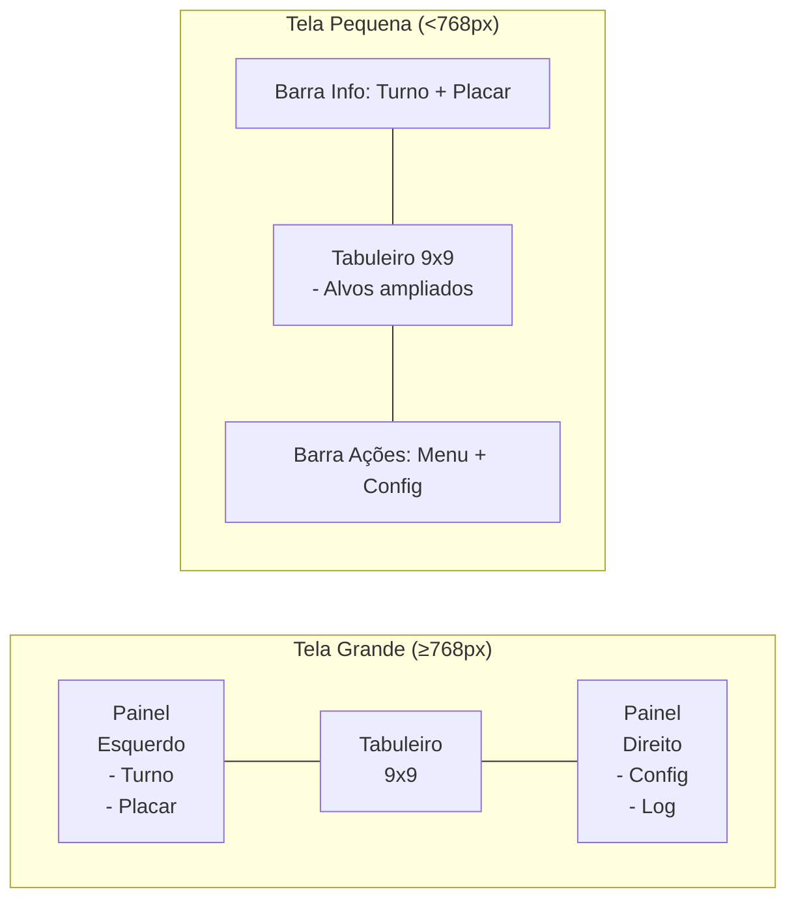
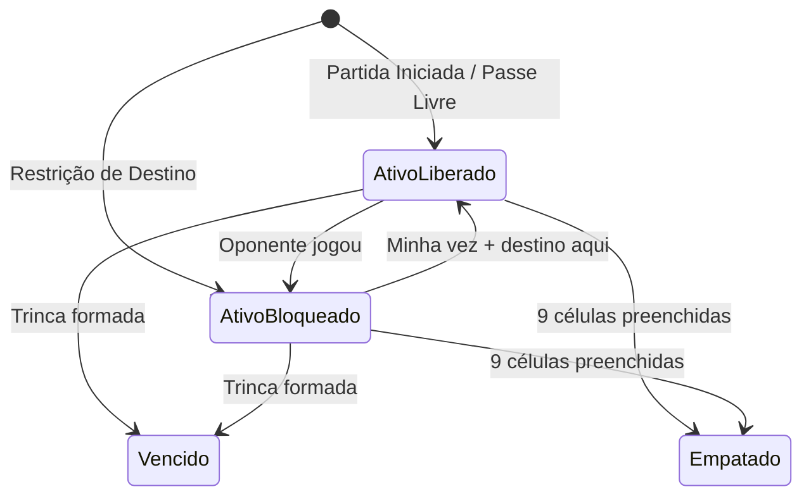
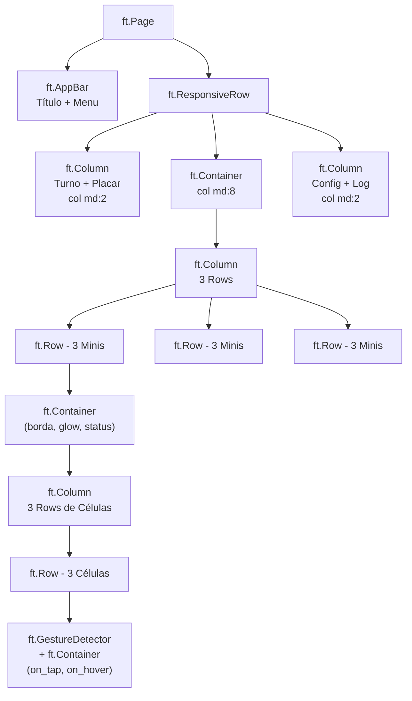

# Design de Interface — Super Jogo da Velha

Este documento especifica o design visual, layout, componentes e estados da interface gráfica construída em **Flet**. É parte do Cânone e complementa as Regras de Negócio §7.

## 1. Layout do Tabuleiro

### 1.1. Estrutura Visual

O tabuleiro é um **grid 3×3 de mini-tabuleiros**, onde cada mini é um **grid 3×3 de células**. A separação entre minis é visualmente mais grossa que a separação entre células internas.

```
┌─────────────┬─────────────┬─────────────┐
│  ·  ·  ·    │  ·  ·  ·    │  ·  ·  ·    │
│  ·  ·  ·    │  ·  ·  ·    │  ·  ·  ·    │
│  ·  ·  ·    │  ·  ·  ·    │  ·  ·  ·    │
├─────────────┼─────────────┼─────────────┤
│  ·  ·  ·    │  ·  ·  ·    │  ·  ·  ·    │
│  ·  ·  ·    │  ·  ·  ·    │  ·  ·  ·    │
│  ·  ·  ·    │  ·  ·  ·    │  ·  ·  ·    │
├─────────────┼─────────────┼─────────────┤
│  ·  ·  ·    │  ·  ·  ·    │  ·  ·  ·    │
│  ·  ·  ·    │  ·  ·  ·    │  ·  ·  ·    │
│  ·  ·  ·    │  ·  ·  ·    │  ·  ·  ·    │
└─────────────┴─────────────┴─────────────┘
```

### 1.2. Layouts por Tamanho de Tela



| Layout | Breakpoint Flet | Características |
|---|---|---|
| **Grande** | `md`+ (≥768px) | Tabuleiro centralizado, painéis laterais com turno/placar/config |
| **Pequeno** | `xs`/`sm` (<768px) | Tabuleiro empilhado, barras acima/abaixo, toque com área mínima ampliada |

## 2. Sistema de Cores

### 2.1. Paleta Base (Proposta)

| Elemento | Cor Sugerida | Hex | Nota |
|---|---|---|---|
| **Jogador X** | Azul vibrante | `#4A90D9` | Marcação e indicadores |
| **Jogador O** | Vermelho coral | `#E74C3C` | Marcação e indicadores |
| **Fundo do tabuleiro** | Cinza escuro / off-white | tema-dependente | Adapta ao modo claro/escuro |
| **Mini ATIVO + liberado** | Borda glow (cor do turno) | — | Destaque sutil animado |
| **Mini ATIVO + bloqueado** | Opacity 30% | — | Esmaecido, dessaturado |
| **Mini VENCIDO** | Marca grande, opacity 40-50% | cor do vencedor | Semitransparente sobre o grid |
| **Mini EMPATADO "V"** | Cinza neutro | `#95A5A6` | "V de Velha" estilizado |
| **Flash de recusa** | Vermelho rápido | `#FF4444` | 200ms, depois desaparece |

> **Nota:** A paleta final é flexível e pode ser ajustada durante a implementação. O importante é manter consistência e contraste.

## 3. Estados Visuais do Mini-Tabuleiro



| Estado Visual | Aparência | Interação |
|---|---|---|
| **ATIVO + Liberado** | Borda glow na cor do turno, células com hover preview | Clicável |
| **ATIVO + Bloqueado** | Opacity 30%, sem glow, dessaturado | Não-clicável (toque/clique dispara micro-feedback de recusa) |
| **VENCIDO** | Símbolo grande (X/O) sobreposto com 40-50% opacity, grid original visível por baixo | Não-clicável, finalizado |
| **EMPATADO** | "V" de Velha estilizado em cinza neutro | Não-clicável, finalizado |

## 4. Estados Visuais da Célula

| Estado | Visual |
|---|---|
| **Vazia + Mini Liberado** | Fundo limpo, ao hover mostra preview do símbolo do jogador (20% opacity) |
| **Vazia + Mini Bloqueado** | Fundo esmaecido, sem hover |
| **Marcada X** | Símbolo X na cor do jogador X, 100% opacity |
| **Marcada O** | Símbolo O na cor do jogador O, 100% opacity |
| **Recusa (transitório)** | Shake 200ms + flash vermelho + haptic (mobile) |

## 5. Hierarquia de Componentes Flet



> **Nota:** `ft.ResponsiveRow` com propriedade `col` por breakpoint controla o layout grande vs pequeno. Em tela pequena, `PainelEsq` e `PainelDir` colapsam para barras acima/abaixo do tabuleiro.

## 6. Telas e Wireframes

### 6.1. Tela Inicial (Menu)

```
┌─────────────────────────────┐
│                             │
│    SUPER JOGO DA VELHA      │
│                             │
│    [ ▶ NOVO JOGO ]          │
│                             │
│         como jogar?         │
│                             │
└─────────────────────────────┘
```

- Botão principal "NOVO JOGO" destacado
- Link "como jogar?" discreto abaixo (texto menor, cor neutra)

### 6.2. Configuração de Partida

```
┌─────────────────────────────┐
│   MODO DE JOGO              │
│                             │
│   (●) Humano vs Humano      │
│   ( ) Humano vs IA          │
│                             │
│   ─────────────────────     │
│   [ ] Jogo Rápido ⚡  [?]   │
│                             │
│   [ ▶ INICIAR PARTIDA ]     │
│                             │
└─────────────────────────────┘
```

- Radio buttons para modo
- Toggle "Jogo Rápido ⚡" com ícone "?" → tooltip
- Tooltip ao pressionar/hover: _"Desativa o tempo de espera da IA (0.5s). A IA joga instantaneamente."_

### 6.3. Tela de Jogo (Tela Grande)

```
┌────────┬───────────────────────────┬────────┐
│        │                           │        │
│ Vez de │  ┌─────┬─────┬─────┐     │ Config │
│   X    │  │ · · │ X · │ · · │     │        │
│        │  │ · · │ · O │ · · │     │        │
│ ────── │  │ · · │ · · │ · · │     │        │
│ Placar │  ├─────┼─────┼─────┤     │        │
│ X: 1   │  │ · · │ · · │ · · │     │        │
│ O: 0   │  │ · X │ · · │ · · │     │        │
│ V: 0   │  │ · · │ · · │ · · │     │        │
│        │  ├─────┼─────┼─────┤     │        │
│        │  │ · · │ · · │ · · │     │        │
│        │  │ · · │ · · │ · · │     │        │
│        │  │ · · │ · · │ · · │     │        │
│        │  └─────┴─────┴─────┘     │        │
│        │                           │        │
└────────┴───────────────────────────┴────────┘
```

### 6.4. Tela de Resultado

```
┌─────────────────────────────┐
│                             │
│      🏆 X VENCEU! 🏆       │
│                             │
│   Placar Final              │
│   X: 4 minis  |  O: 3 minis│
│                             │
│   [ 🔄 REVANCHE ]          │
│   [    MENU     ]           │
│                             │
└─────────────────────────────┘
```

## 7. Animações e Transições

| Evento | Animação | Duração |
|---|---|---|
| Marcar símbolo | Fade-in + scale sutil (0.8→1.0) | 150ms |
| Conquistar mini | Símbolo grande surge com scale (0→1) + pulse | 400ms |
| Empate (Velha) | "V" surge com fade-in | 300ms |
| Jogada recusada | Shake horizontal (3px, 2 ciclos) + flash vermelho | 200ms |
| IA pensando | Pulso/breathing na borda do tabuleiro | Loop durante delay |
| Passe Livre ativado | Glow em todos os minis ATIVOS simultaneamente | 300ms |
| Fim de jogo | Tabuleiro escurece + modal de resultado sobe | 500ms |
| Transição de tela | Fade + slide lateral | 250ms |
