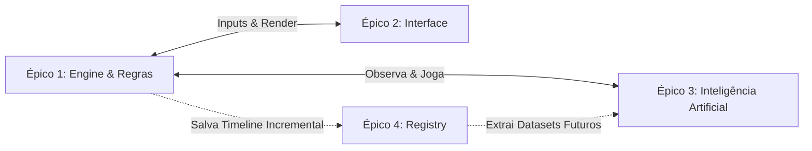

# Histórias de Usuário (User Stories)

Este documento elenca as histórias de usuário divididas por Épicos. Elas abstraem os requisitos funcionais, técnicos e regras de negócio estritas que irão guiar os testes (TDD).

## Épico 1: A Engine e as Regras de Negócio (Core)

**US1.1: Inicialização**
> "Como jogador, quero iniciar uma partida com um macro-tabuleiro vazio composto de 9 mini-tabuleiros, para começar o jogo com o tabuleiro limpo."
- *Critério de Aceite:* A engine inicializa uma matriz de estado representando os 9x9 espaços. Nenhuma posição preenchida. 

**US1.2: Jogada Básica e Posicionamento**
> "Como jogador, quero que o sistema registre meu 'X' ou 'O', validando se a célula está vazia."
- *Critério de Aceite:* Uma jogada numa célula não-vazia deve retornar erro/invalid match.

**US1.3: Restrição de Movimento (A Regra de Ouro)**
> "Como sistema, quero forçar o próximo jogador a jogar no mini-tabuleiro correspondente à posição relativa da última jogada feita pelo oponente."
- *Critério de Aceite:* Se a última jogada ocorreu na Célula Central (linha 1, coluna 1 do mini-tabuleiro que vai de 0 a 2), o próximo input DEVE obrigatoriamente ser no mini-tabuleiro Central. Qualquer outro input será rejeitado.

**US1.4: Conquista de Mini-Tabuleiro**
> "Como jogador, quero dominar um mini-tabuleiro inteiro caso eu alinhe 3 símbolos nele (horizontal, vertical ou diagonal)."
- *Critério de Aceite:* A engine muda o status do mini-tabuleiro para Vencido por [X/O] permanentemente, independente se os próximos oponentes caírem nele de novo.

**US1.5: 'Passe Livre' (Célula Cheia/Finalizada)**
> "Como jogador, quero ganhar o direito de jogar em *qualquer* mini-tabuleiro aberto caso a jogada anterior do meu oponente me direcione para um mini-tabuleiro que já foi completado (sem espaços, empatado) ou já foi conquistado por alguém."
- *Critério de Aceite:* A validação de destino ignorará qualquer restrição no turno atual, contanto que o destino seja um mini-tabuleiro ainda disputável.

**US1.6: Empate ('Velha') em Mini-Tabuleiro**
> "Como jogador, quero que o sistema reconheça quando um mini-tabuleiro 'deu velha' (9 células preenchidas sem vencedor)."
- *Critério de Aceite:* O mini-tabuleiro muda para status "Empatado", não concedendo vitória a ninguém. Fica indisponível para jogadas e concede "Passe Livre" a quem for mandado para ele.

**US1.7: Condição de Fim de Jogo (Vitória)**
> "Como jogador, quero ganhar o jogo inteiro (Game Over) ao formar uma linha, coluna ou diagonal de mini-tabuleiros conquistados."
- *Critério de Aceite:* A engine identifica padrões de vitória no macro-tabuleiro e imediatamente marca a partida como ENCERRADA.

**US1.8: Fim de Jogo sem Alinhamento (Vitória por Pontos)**
> "Como jogador, quero que a partida termine se não houver mais jogadas válidas (todos os 9 mini-tabuleiros finalizados) e que o vencedor seja aquele que conquistou a maior quantidade de mini-tabuleiros."
- *Critério de Aceite:* Se for impossível formar trincas e o jogo esgotar, a Engine conta o número de tabuleiros `VENCIDO_X` vs `VENCIDO_O` e declara o dono da maior pontuação como o vencedor absoluto da Partida. O empate absoluto só ocorrerá na raríssima exceção de um score igualitário causado por mini-tabuleiros que terminaram em "Velha".

**US1.9: Jogador Inicial Fixo**
> "Como jogador, sei que quem joga com o 'X' tem sempre a vantagem do primeiro movimento."
- *Critério de Aceite:* A engine sempre inicia o estado da partida aguardando o input do jogador 'X'. Não há sorteio na engine.

**US1.10: Tolerância a Erros de Input**
> "Como jogador, se eu clicar num lugar inválido ou tentar burlar a regra, quero que a jogada seja apenas recusada, sem que eu perca a minha vez."
- *Critério de Aceite:* Inputs inválidos disparam exceções (`InvalidMoveException` ou similares). O estado do jogo (e de quem é a vez) não avança até que uma coordenada válida seja enviada.

## Épico 2: Interface de Usuário (Flet)

**US2.1: Orientação Visual**
> "Como usuário, quero saber instantaneamente em qual mini-tabuleiro eu posso ou devo jogar."
- *Critério de Aceite:* Mini-tabuleiros liberados têm destaque visual (borda/glow). Mini-tabuleiros bloqueados ficam esmaecidos/desabilitados. (Regras §7.3)

**US2.2: Feedback de Jogada Recusada**
> "Como jogador, quero que a interface me indique sutilmente que minha jogada não foi aceita, sem interromper o jogo."
- *Critério de Aceite:* Jogada recusada pela Engine → shake sutil + flash vermelho (~200ms) na célula. Em mobile, adiciona-se vibração haptic leve. Sem popup, sem perda de vez. (Regras §7.7)

**US2.3: Seleção de Modo de Partida**
> "Como jogador, quero escolher entre jogar contra outro humano ou contra a IA antes do início."
- *Critério de Aceite:* Tela de configuração oferece modos HUMANO_VS_HUMANO e HUMANO_VS_IA, com toggle "Jogo Rápido ⚡" (tooltip com ícone "?" explicando o delay da IA). (Regras §7.4)

**US2.4: Responsividade Multiplataforma**
> "Como jogador, quero jogar no celular, no computador ou no navegador com a mesma qualidade de experiência."
- *Critério de Aceite:* Dois layouts via Flet breakpoints — tela grande (≥768px, painéis laterais) e tela pequena (<768px, empilhado com alvos de toque ampliados). Design adaptivo por plataforma (Material/Cupertino). (Regras §7.6)

**US2.5: Tela de Fim de Jogo**
> "Como jogador, quero ver claramente quem venceu, o placar de mini-tabuleiros, e ter opção de jogar novamente."
- *Critério de Aceite:* Overlay/modal exibindo vencedor, placar final (minis conquistados X vs O), e botões "Revanche" e "Menu". (Regras §7.5)

**US2.6: Indicador de IA Pensando**
> "Como jogador humano, quero ver uma animação enquanto a IA processa sua jogada."
- *Critério de Aceite:* Animação/indicador visual durante o delay mínimo de 0.5s (ou tempo real de processamento). Desativável via "Jogo Rápido". (Regras §7.3, §5.3)

**US2.7: Reinício Rápido (Revanche)**
> "Como jogador, quero recomeçar uma nova partida imediatamente sem voltar ao menu principal."
- *Critério de Aceite:* Botão "Revanche" na tela de resultado inicia nova partida com mesmas configurações (modo, jogo rápido). (Regras §7.5)

**US2.8: Placar Visual de Conquistas**
> "Como jogador, quero ver de relance quantos mini-tabuleiros cada jogador já conquistou."
- *Critério de Aceite:* Indicador visível durante a partida mostrando contagem de minis VENCIDO_X e VENCIDO_O. Atualiza em tempo real.

**US2.9: Onboarding "Como Jogar"**
> "Como jogador novo, quero entender as regras do Super Jogo da Velha através de uma explicação visual passo-a-passo."
- *Critério de Aceite:* Botão discreto no menu abre tela de onboarding explicando: conceito macro/mini, regra de ouro, passe livre, conquista, vitória. (Regras §7.5)

## Épico 3: Inteligência Artificial

**US3.1: Oponente Solitário**
> "Como jogador humano, quero jogar contra a máquina (IA)."
- *Critério de Aceite:* O Módulo AI recebe o state board da Engine e retorna a tupla exata de jogada (linha_macro, coluna_macro, linha_mini, coluna_mini) dentro do tempo de resposta admissível. A Engine deve aceitar isso como uma jogada válida equivalente à do humano.

**US3.2: Priorização Tática**
> "Como IA, quero priorizar jogadas que completem uma trinca no mini-tabuleiro atual, ou que bloqueiem a trinca iminente do oponente."
- *Critério de Aceite:* Se existe uma jogada que conquista um mini-tabuleiro, a IA a executa. Se o oponente está a uma jogada de conquistar um mini, a IA bloqueia. (Regras §5.2, prioridades 1 e 2)

**US3.3: Consciência Estratégica de Destino**
> "Como IA, quero evitar enviar o oponente para um mini-tabuleiro onde ele tem vantagem ou onde ele ganha Passe Livre, e priorizar mandá-lo para minis onde nós temos vantagem."
- *Critério de Aceite:* A IA avalia o impacto de cada jogada no destino obrigatório do oponente. Evita minis decididos (Passe Livre = liberdade total ao oponente) e prioriza destinos onde nós temos posição dominante. (Regras §5.2, prioridades 4 e 5)

**US3.4: Tempo de Resposta**
> "Como jogador, quero que a IA responda em no máximo 3 segundos para manter a fluidez da partida."
- *Critério de Aceite:* Se a IA ultrapassar 3s, o Registry registra alerta. O jogo não interrompe. Em V1 heurística, a resposta é quase instantânea. (Regras §5.3)

**US3.5: Contrato Válido**
> "Como sistema, espero que a IA nunca envie uma jogada inválida. Se isso acontecer, é bug e o sistema trata silenciosamente."
- *Critério de Aceite:* Se a IA errar, a Engine recusa sem punição (mesma regra do humano), a IA recebe o mesmo estado para retry, e o Registry registra o incidente como `ERRO_SISTEMA`. (Regras §5.4)

**US3.6: Feedback Visual de "Pensando"**
> "Como jogador humano, quero ver que a IA está processando sua jogada, mesmo que a resposta seja quase instantânea."
- *Critério de Aceite:* A jogada da IA é segurada por mínimo 0.5s com animação/indicador visual. Existe uma opção de partida para desativar este delay. (Regras §5.3)

## Épico 4: Registry e Rastreabilidade

**US4.1: Payload Único e Incremental da Partida**
> "Como mantenedor (desenvolvedor), quero que para cada partida exista um único payload de registro que seja continuamente incrementado com o passo-a-passo de cada jogada, erro de regra ou mudança de estado."
- *Critério de Aceite:* No momento da inicialização do jogo, o Registry cria o escopo primário sob um `match_id` (UUID). Cada input, validação, jogada válida (estado antes/depois) e exceções disparadas são apensados como eventos cronológicos na `timeline` deste payload único. (Regras §6.2, §6.3)

**US4.2: Estrutura Padronizada do Payload**
> "Como desenvolvedor, quero que o payload tenha formato JSON definido e documentado para facilitar análise e integração com ferramentas de dados."
- *Critério de Aceite:* O `MatchPayload` segue o schema definido em Regras §6.2 (match_id, timestamps, modo, configurações, resultado_final, timeline). Cada evento possui step_number, timestamp, tipo, jogador e dados. (Regras §6.3)

**US4.3: Persistência Resiliente**
> "Como desenvolvedor, quero que em caso de crash o payload parcial seja salvo imediatamente, sem perda de dados registrados até aquele ponto."
- *Critério de Aceite:* O payload é persistido incrementalmente a cada evento (write-ahead). Mesmo que o processo morra, o JSON parcial estará em disco. (Regras §6.4)

**US4.4: Reprodução de Partida**
> "Como desenvolvedor, quero reproduzir uma partida inteira a partir do payload, step-by-step, para debug e para gerar datasets de treinamento da IA."
- *Critério de Aceite:* O payload contém informação suficiente (estado antes/depois de cada jogada) para reconstruir cada passo da partida do início ao fim. O formato JSON é importável por ferramentas de análise de dados. (Regras §6.5)
