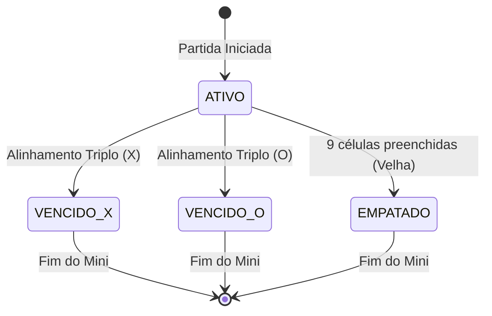
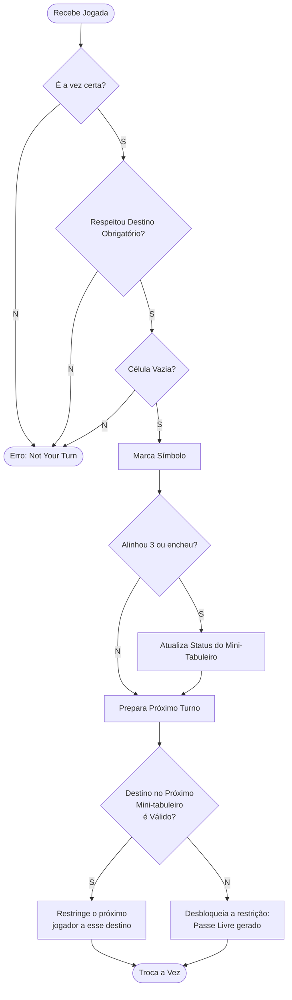
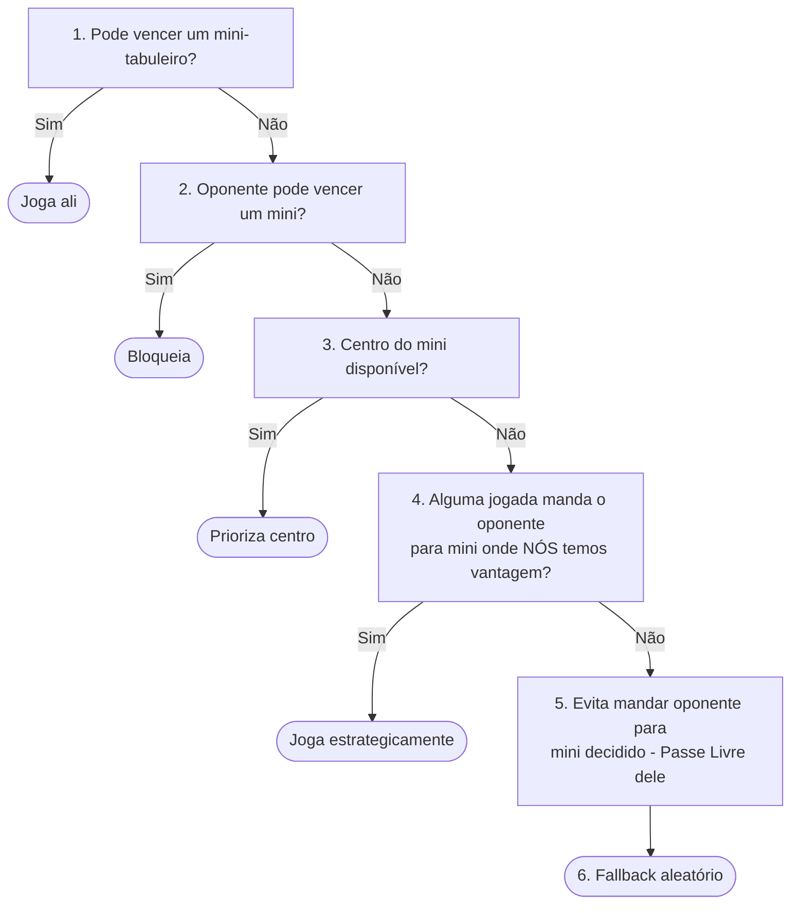
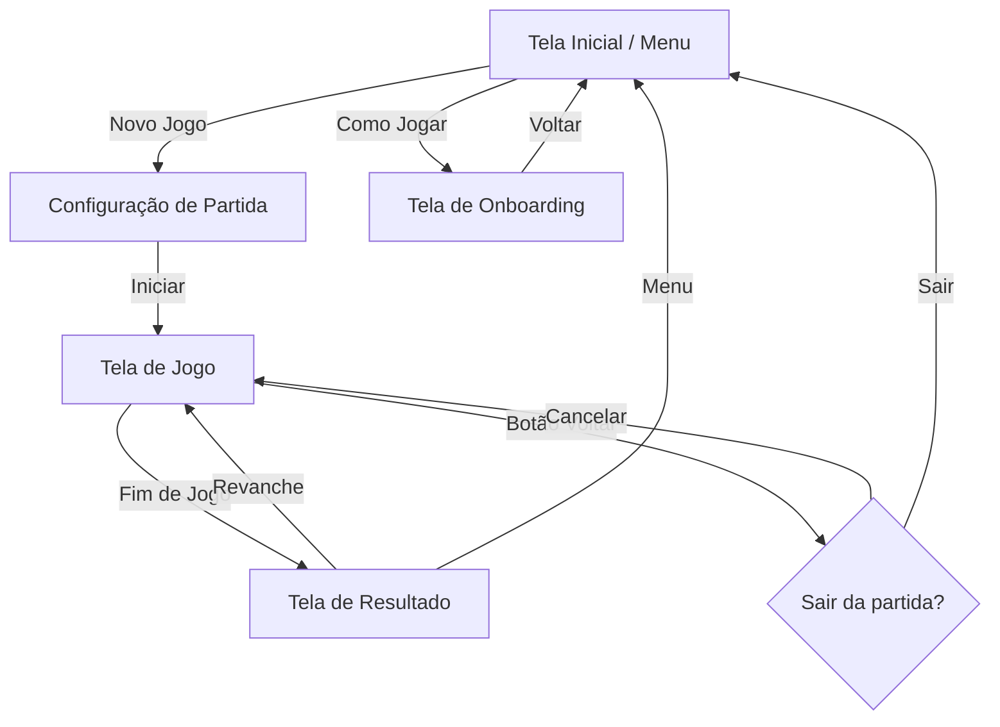

# Regras de Negócio (Core Engine)

Este documento dita o comportamento matemático e lógico inflexível que será implementado na Engine. Qualquer ambiguidade na programação deve ser resolvida retornando a este texto.

## 1. Topologia do Jogo

- O "Macro-Tabuleiro" é uma matriz `3x3`.
- Dentro de cada célula do macro-tabuleiro, existe um "Mini-Tabuleiro" que é também uma matriz `3x3`.
- Portanto, existem 9 mini-tabuleiros (numerados conceitualmente de 0 a 8 ou representados por coords `[X][Y]`), totalizando 81 casas individuais.

## 2. Máquina de Estados

### 2.1 Mini-Tabuleiro (Estado Isolado)

Cada mini-tabuleiro individual só pode estar em um dos 4 estados abaixo:



*Ordem de Avaliação:* Logo após um input, a Engine verifica `Vitória`. Se houver linha, vira `VENCIDO`. Se não houver linha E o espaço está cheio, vira `EMPATADO`.

### 2.2 Macro-Tabuleiro (Partida)

1. `EM_ANDAMENTO`: Jogo corrente em turnos alternados.
2. `VITORIA_X`: X alinhou 3 mini-tabuleiros que estão em estado `VENCIDO_X`.
3. `VITORIA_O`: O alinhou 3 mini-tabuleiros que estão em estado `VENCIDO_O`.
4. `EMPATE_ABSOLUTO`: Todos os 9 mini-tabuleiros saíram do estado `ATIVO` e as pontuações entre vitórias X e O deram idênticas.

## 3. Fluxo de Validação de Jogada

Todo input (`Coordenada_Macro`, `Coordenada_Mini`) enviado para a Engine passa pelo seguinte pipeline restrito:



**Passo 1: Verificação de Turno**

- É a vez de quem enviou a jogada? Se não, lance `NotYourTurnException`.

**Passo 2: Verificação de Restrição Alvo**

- A propriedade do estado `proximo_mini_tabuleiro_obrigatorio` está setada?
- **SE SIM:** O `Coordenada_Macro` recebido confere com essa restrição? Se não conferir, lance `InvalidMiniBoardException`. (O jogador é obrigado a jogar onde a regra mandou).

**Passo 3: Verificação de Célula Livre**

- A célula destino descrita em `Coordenada_Mini` dentro do mini-tabuleiro selecionado está `"VAZIA"`?
- Se já tiver 'X' ou 'O', lance `CellOccupiedException`.

**Passo 4: Aplicação e Avaliação de Mini-Tabuleiro**

- Ocorre a marcação do símbolo do jogador.
- A Engine re-avalia o status do mini-tabuleiro alvo. Ele virou `VENCIDO` ou `EMPATADO`?

**Passo 5: Definição do Próximo Tabuleiro Obrigatório (A Regra de Ouro)**

- A Engine converte a `Coordenada_Mini` onde a jogada acabou de acontecer no índice de macro-tabuleiro.
- A Engine olha o status desse novo alvo do macro-tabuleiro que o jogador pretendia mandar oponente.
- **DELIBERAÇÃO DE STATUS:** Se o status desse novo mini-tabuleiro alvo for `ATIVO`, a regra se aplica: `proximo_mini_tabuleiro_obrigatorio` ganha a coordenada desse destino, prendendo o próximo jogador a nele.
- **'PASSE LIVRE' (Velha / Conquista):** Se o novo mini-tabuleiro alvo for `VENCIDO_X`, `VENCIDO_O` ou `EMPATADO`, a regra desliga. O valor de `proximo_mini_tabuleiro_obrigatorio` vira `LIVRE` (Null/Any). O próximo oponente ganha carta branca para escolher qualquer mini-tabuleiro que esteja `ATIVO`.

**Passo 6: Condição de Vitória Global**

- A Engine avalia o macro-tabuleiro inteiro com a mesma matemática de alinhamento 3x3 do Passo 4 para determinar o status do Macro-Tabuleiro.

## 4. Deliberações e Resoluções de Edge Cases

### 4.1. Quem Começa o Jogo?

- **Regra:** O primeiro jogador a mover é sempre o **X**.
- Não há input de escolha (Interface) para simplificar a estrutura do registro. Se os jogadores quiserem alternar quem começa as partidas (ex: Maria joga agora, na próxima quem começa é o João e ele será o X), o front fará apenas a adaptação visual de atribuição do jogador ao símbolo. A Engine sempre espera X iniciando o index 0.

### 4.2. Tratamento de Exceções Lógicas / Entradas Inválidas

- **Regra:** Jogadas inválidas (ex: tentar jogar na casa do oponente, num mini-tabuleiro errado ou já vencido, ou fora de sua vez) **NÃO** punem o jogador com perda de turno.
- **Fluxo:** A Engine apenas recusa a transação e lança a Exceção pertinente (`InvalidMoveException`). A Interface captura isso e mantém o jogador "preso" no turno atual aguardando uma jogada válida.

### 4.3. Regra de Esgotamento do Macro-Tabuleiro (Vitória por Pontos)

- **Regra:** O "empate verdadeiro" no macro-tabuleiro não ocorre em circunstâncias normais, pois o número ímpar (9) de mini-tabuleiros garante o desempate na contagem de conquiastas. Caso o tabuleiro global esgote de movimentos sem que ninguém alinhe 3 vitórias na tela primária, a Engine entra em Modo de Pontuação.
- **Fluxo:** A Engine conta a quantidade de Placas `VENCIDO_X` e `VENCIDO_O`. Quem tiver mais placas ganha o jogo. Um retorno de estado `EMPATE_ABSOLUTO` do Macro-Tabuleiro só existirá se a matemática de pontuações empatar estritamente devido às exceções de mini-tabuleiros que resultaram em "Velha".

### 4.4. A Estrutura do Registry (Registro Contínuo)

- **Regra:** A rastreabilidade do jogo **NÃO** gerará um pacote descentralizado de logs. Toda a execução da partida possui um Payload Único de Estado.
- **Fluxo:** Quando o jogo inicia, a Engine abre via Registry um objeto mestre `MatchPayload` (ou `ExecutionPayload`). Todo e qualquer evento (Jogada bem-sucedida, Jogada Inválida, Troca de Status, Exceptions da Engine ou demora de processamento da IA) é "appendado" como um step incremental na *timeline* desse payload. No encerramento da partida, o arquivo consolidado será salvo. Isso formará a base de treinamento da futura IA (pois contém a árvore de estado de todas as tomadas de decisão daquela partida em um só container legal).

### 4.5. Catálogo de Exceções da Engine

Toda jogada inválida é recusada pela Engine sem punição ao jogador (ver 4.2). As exceções são tipadas e identificáveis para que a Interface e o Registry possam tratá-las de forma granular.

| Exceção | Gatilho | Referência no Pipeline (Seção 3) |
|---|---|---|
| `InvalidMoveException("NotYourTurn")` | Jogador tenta enviar input quando não é sua vez | Passo 1: Verificação de Turno |
| `InvalidMoveException("InvalidMiniBoard")` | Jogador escolhe um mini-tabuleiro diferente do obrigatório (`proximo_mini_tabuleiro_obrigatorio`) | Passo 2: Verificação de Restrição Alvo |
| `InvalidMoveException("CellOccupied")` | Jogador tenta marcar uma célula que já possui `X` ou `O` | Passo 3: Verificação de Célula Livre |
| `InvalidMoveException("InactiveMiniBoard")` | Jogador (em Passe Livre) escolhe um mini-tabuleiro com status `VENCIDO` ou `EMPATADO` | Passo 2: Validação de mini-tabuleiro `ATIVO` |
| `InvalidMoveException("GameOver")` | Qualquer input após o `status_jogo` sair de `EM_ANDAMENTO` | Pré-validação: Jogo já encerrado |

> **Nota de Implementação:** Todas as exceções herdam de uma classe base `InvalidMoveException`. A mensagem string entre parênteses é o identificador programático. A Engine pode optar por implementar subclasses individuais no futuro, desde que mantenham compatibilidade com este catálogo.

## 5. Regras de Negócio da IA Heurística (V1)

### 5.1. Contrato de Entrada e Saída

A IA opera como um **módulo consumidor** da Engine. Ela recebe um snapshot público e serializável do estado do jogo e devolve uma jogada.

**Entrada (Snapshot Público):**

| Dado | Tipo | Descrição |
|---|---|---|
| `macro_tabuleiro` | Matriz 3x3 de MiniTabuleiros | Cada mini contém `status` e `celulas` (3x3) |
| `turno_atual` | `"X"` ou `"O"` | De quem é a vez |
| `proximo_mini_tabuleiro_obrigatorio` | Tupla `(linha, coluna)` ou `None` | Restrição de destino ativo |

A IA **NÃO** recebe estado interno privado da Engine (contadores de performance, referências internas, callbacks, histórico de jogadas passadas). Ela vê apenas a "foto do tabuleiro" — o mesmo que qualquer humano veria olhando para a tela.

**Saída:**

- Tupla `(linha_macro, coluna_macro, linha_mini, coluna_mini)` — a jogada escolhida.
- A jogada é submetida à Engine via o mesmo método `jogar()` que o humano utiliza.

### 5.2. Hierarquia de Prioridades (Heurística V1)

A IA avalia as jogadas possíveis seguindo esta cadeia de prioridade, da mais urgente à menos:



1. **Vitória Imediata:** Se alguma jogada completa uma trinca no mini-tabuleiro atual → executa.
2. **Bloqueio:** Se o oponente está a uma jogada de vencer um mini → bloqueia.
3. **Centro:** Se o centro do mini está vazio → prioriza (controle estratégico).
4. **Destino Ofensivo:** Prioriza jogadas que forcem o oponente a jogar em minis onde **nós** temos vantagem posicional.
5. **Evitar Passe Livre do Oponente:** Evita jogadas que mandem o oponente para minis já decididos (`VENCIDO`/`EMPATADO`), pois isso lhe dá liberdade total de jogar onde quiser.
6. **Fallback Aleatório:** Entre as opções restantes, escolhe aleatoriamente.

### 5.3. Regras de Tempo

- **Soft target: 3 segundos.** Se a IA ultrapassar 3s para decidir, o Registry registra um alerta de performance. O jogo **não** é interrompido.
- **Tempo mínimo: 0.5 segundo.** Para que o humano perceba que a IA "está pensando", a jogada é segurada por no mínimo 500ms, com **feedback visual** na Interface (animação/indicador de "pensando").
- **Opção de Partida:** Existe uma configuração de partida para desativar o delay mínimo de 0.5s (útil para testes automatizados ou speedruns).

### 5.4. Tratamento de Erros da IA

- A IA **nunca deveria** enviar uma jogada inválida. Se isso ocorrer, é classificado como **bug**.
- O sistema trata o erro silenciosamente: a Engine recusa a jogada (mesma regra do humano — sem punição, sem alarde para o usuário), e a IA recebe o mesmo estado de volta para tentar novamente.
- O Registry registra o incidente discretamente no payload como evento `ERRO_SISTEMA` para fins de debug.

## 6. Regras de Negócio do Registry

### 6.1. Princípio de Passividade

O Registry é um **observador passivo**. Ele **nunca** altera o fluxo do jogo, nunca bloqueia uma jogada e nunca interfere na Engine. Sua responsabilidade é exclusivamente registrar o que acontece.

### 6.2. Schema do MatchPayload

Cada partida gera um único arquivo `MatchPayload` com a seguinte estrutura:

```json
{
  "match_id": "UUID",
  "timestamp_inicio": "ISO-8601",
  "timestamp_fim": "ISO-8601 | null",
  "modo": "HUMANO_VS_IA | HUMANO_VS_HUMANO",
  "configuracoes": {
    "delay_minimo_ia": true
  },
  "resultado_final": "VITORIA_X | VITORIA_O | EMPATE_ABSOLUTO | null",
  "timeline": []
}
```

### 6.3. Tipos de Evento na Timeline

Cada evento na `timeline` segue esta estrutura:

| Campo | Tipo | Descrição |
|---|---|---|
| `step_number` | `int` | Sequencial: 1, 2, 3… |
| `timestamp` | `string` | ISO-8601 do momento do evento |
| `tipo` | `string` | Tipo do evento (ver tabela abaixo) |
| `jogador` | `string` | `"X"`, `"O"` ou `"SISTEMA"` |
| `dados` | `object` | Detalhes que variam por tipo |

**Tipos de Evento:**

| Tipo | Quando Ocorre | Dados Incluídos |
|---|---|---|
| `JOGADA_VALIDA` | Jogada aceita pela Engine | Coordenadas, símbolo, estado antes/depois da célula |
| `JOGADA_INVALIDA` | Jogada recusada pela Engine | Coordenadas tentadas, exceção lançada, motivo |
| `MUDANCA_STATUS_MINI` | Mini-tabuleiro muda de `ATIVO` para `VENCIDO`/`EMPATADO` | Índice do mini, status anterior, status novo |
| `MUDANCA_STATUS_MACRO` | Partida muda de `EM_ANDAMENTO` para fim | Status anterior, status novo, placar final |
| `ERRO_SISTEMA` | Erro inesperado (ex: bug da IA) | Stack trace, estado no momento do erro |

> **Nota:** `JOGADA_INVALIDA` é registrada mesmo sendo silenciosa para o usuário. Sua utilidade é: (1) debug — detectar bugs da IA, (2) datasets — para ML futuro, saber o que foi tentado vs aceito é feature valiosa em reinforcement learning.

### 6.4. Persistência Resiliente (Write-Ahead)

- O payload é persistido incrementalmente a cada evento. Em caso de crash, o payload parcial já está salvo em disco.
- No encerramento normal da partida, o campo `timestamp_fim` e `resultado_final` são preenchidos e o arquivo é consolidado.

### 6.5. Formato de Saída

- **JSON puro**, legível por humanos e por ferramentas de análise de dados.
- Cada payload é um arquivo independente (ex: `match_{uuid}.json`).
- O acervo de payloads formará o **dataset de treinamento** para a futura IA baseada em ML.

## 7. Regras de Negócio da Interface (Flet)

### 7.1. Princípio de Agnosticismo ("Interface Burra")

A Interface **NÃO** aplica, valida ou decide regras de jogo. Sua responsabilidade é exclusivamente:

1. **Renderizar** o estado recebido da Engine.
2. **Capturar** coordenadas de clique/toque do jogador humano e enviá-las à Engine.
3. **Exibir** o resultado das decisões da Engine (aceitou, recusou, jogo acabou).

Toda decisão de "isso é válido?" pertence à Engine. A Interface confia cegamente no estado que recebe.

### 7.2. Renderização de Estado

A Interface consome um objeto de estado da Engine contendo:

| Dado | Uso Visual |
|---|---|
| `macro_tabuleiro` (9 minis com `status` + `celulas`) | Renderizar tabuleiro completo |
| `turno_atual` (`"X"` / `"O"`) | Indicador de turno |
| `proximo_mini_tabuleiro_obrigatorio` | Destacar mini permitido / esmaecer outros |
| `status_jogo` | Detectar fim de jogo → tela de resultado |

A cada atualização de estado recebida, a Interface **re-renderiza** todos os componentes afetados.

### 7.3. Feedback Visual Obrigatório

| Estado | Visual |
|---|---|
| Mini-tabuleiro **ATIVO + liberado** | Borda/glow destacado — clicável |
| Mini-tabuleiro **ATIVO + bloqueado** (restrição) | Esmaecido/desabilitado — não-clicável |
| Mini-tabuleiro **VENCIDO** | Símbolo grande do vencedor (X ou O) sobreposto com **opacidade reduzida (~40-50%)**, permitindo ver as marcações originais por baixo |
| Mini-tabuleiro **EMPATADO** | Exibe **"V"** estilizado (de "Velha") com cor neutra diferenciada |
| Indicador de **turno** | Texto "Vez de X" / "Vez de O" com cor do jogador |
| Célula em **hover** (desktop) | Preview sutil da marca do jogador atual (opacidade baixa) |
| **IA Pensando** | Animação/indicador visual durante o delay (mínimo 0.5s, §5.3) |
| **Fim de jogo** | Overlay/modal com resultado, placar e opção de revanche |

### 7.4. Modos de Partida

A Interface oferece dois modos, selecionados antes do início:

| Modo | Descrição |
|---|---|
| `HUMANO_VS_HUMANO` | Dois jogadores alternando no mesmo dispositivo |
| `HUMANO_VS_IA` | Um jogador humano, outro controlado pela IA |

**Opção "Jogo Rápido ⚡":** Toggle disponível na tela de configuração de partida. Ao lado, um ícone **"?"** exibe um tooltip flutuante (popup que aparece enquanto pressionado/hover) com a explicação: *"Desativa o tempo mínimo de espera da IA (0.5s). A IA jogará instantaneamente."* O valor é passado à Engine como `configuracoes.delay_minimo_ia` no `MatchPayload`.

### 7.5. Telas e Fluxo de Navegação



- **Tela Inicial (Menu):** Opções principais (Novo Jogo) e link discreto/não-destacado para "Como Jogar".
- **Tela de Onboarding ("Como Jogar"):** Explicação visual passo-a-passo das regras do Super Jogo da Velha — conceito macro/mini, regra de ouro (restrição de destino), passe livre, conquista, vitória global.
- **Configuração de Partida:** Seleção de modo (HvH / HvIA) + toggle "Jogo Rápido".
- **Tela de Jogo:** Tabuleiro + indicador de turno + placar de conquistas.
- **Tela de Resultado:** Exibe vencedor, placar final de mini-tabuleiros, opção de "Revanche" (reinicia sem voltar ao menu) ou "Menu".

### 7.6. Responsividade e Plataformas

O Flet suporta `ResponsiveRow` com breakpoints e `MediaQuery` para layouts adaptáveis. A estratégia é **uma codebase, dois layouts**:

| Classificação | Breakpoint | Layout |
|---|---|---|
| **Tela grande** | ≥768px (`md`+) | Tabuleiro centralizado com painéis laterais (turno, placar, configurações) |
| **Tela pequena** | <768px (`xs`/`sm`) | Tabuleiro empilhado verticalmente, barra de informações acima/abaixo, alvos de toque com área mínima ampliada |

- **`page.design = ADAPTIVE`** aplicará design nativo por plataforma (Material no Android, Cupertino no iOS).
- Em **mobile**, interações são por toque; em **desktop**, adicionam-se efeitos de hover.

### 7.7. Feedback de Jogada Recusada

Quando a Engine recusa uma jogada (`InvalidMoveException`), a Interface trata silenciosamente — **sem popup, sem alerta, sem perda de vez**. Porém aplica micro-feedback:

| Plataforma | Feedback |
|---|---|
| **Desktop/Web** | Shake sutil na célula + flash vermelho rápido (~200ms) |
| **Mobile** | Mesma animação + **vibração leve** (haptic feedback) |

O objetivo é que o jogador perceba que clicou errado sem que o fluxo do jogo seja interrompido.

### 7.8. Saída Mid-Game

Se o jogador acionar o botão de retorno ("←" do AppBar ou gesto de retorno do sistema) durante uma partida em andamento:

1. A Interface exibe um **diálogo modal de confirmação** perguntando se deseja sair.
2. **CANCELAR:** Fecha o diálogo e retorna à partida sem alteração de estado.
3. **SAIR:** A partida é **descartada** — o Registry não registra a partida abandonada. A Interface remove a view de Jogo e retorna ao Menu.

> **Nota:** Partidas abandonadas não geram `MatchPayload`. O descarte é silencioso.
